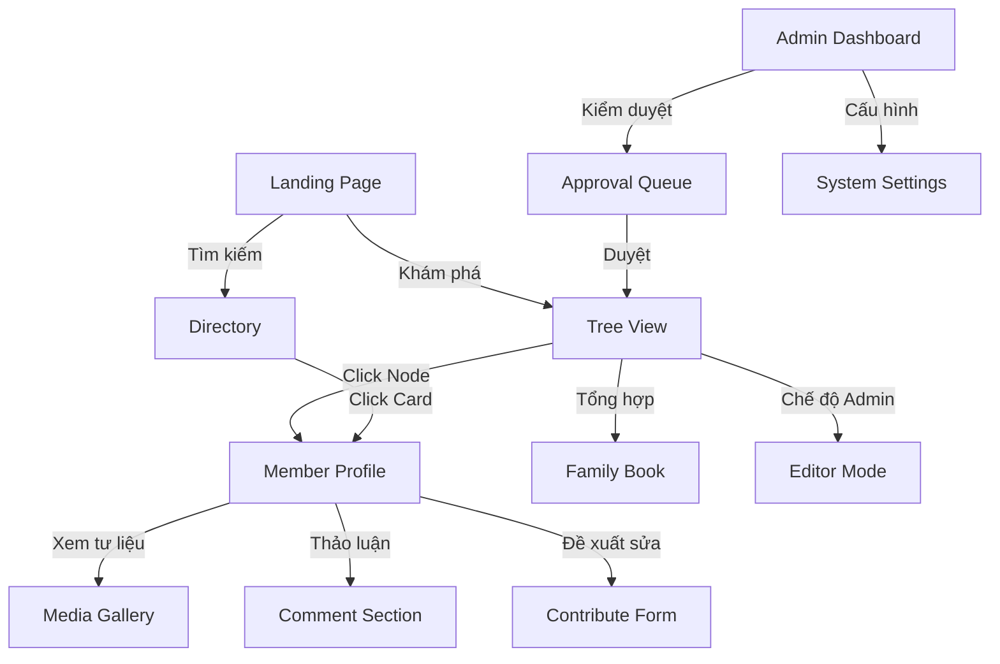

# 🗺️ Lộ trình Phát triển Chi tiết Dự án Gia Phả Điện Tử

Dòng họ **Đỗ Quý** - Kết nối cội nguồn qua trải nghiệm kỹ thuật số cao cấp.

---

## 1. Phân tích Use Cases (Usecase Analysis)

| Đối tượng | Use Case chính | Mô tả |
| :--- | :--- | :--- |
| **Thành viên vãng lai** | Tra cứu cội nguồn | Tìm kiếm thông tin bản thân, tổ tiên, xem quan hệ huyết thống. |
| **Thành viên đóng góp** | Đề xuất chỉnh sửa | Gửi yêu cầu cập nhật ngày sinh, hình ảnh hoặc thêm thành viên mới. |
| **Quản trị viên (Admin)** | Kiểm duyệt dữ liệu | Review các yêu cầu đóng góp, quản lý schema phả hệ, xuất dữ liệu. |
| **Trưởng tộc/Hậu duệ** | Lưu trữ di huấn | Viết tiểu sử, tải lên tư liệu quý giá (sắc phong, văn bia). |

---

## 2. Luồng Nghiệp vụ & Bản đồ Màn hình (Workflows & Screen-flow)

### 2.1. Bản đồ Màn hình & Điều hướng (Comprehensive Screen Map)

Cấu trúc phân cấp màn hình giúp xây dựng luồng trải nghiệm người dùng (UX) nhất quán.

### 2.2. Các Luồng Nghiệp vụ Chính (Core User Journeys)

#### A. Luồng Tra cứu & Kết nối (Discovery Journey)

*Áp dụng: Người dùng tìm kiếm thông tin về cội nguồn.*

1. **Khởi đầu**: Vào Landing Page -> Dùng Global Search để tìm tên.
2. **Định vị**: Chuyển đến trang **Tree View**, Node của người đó được Highlight và Zoom tự động.
3. **Mở rộng**: Sử dụng bộ lọc "Tổ tiên" hoặc "Hậu duệ" để xem nhanh các nhánh liên quan.
4. **Chi tiết**: Click vào Node để mở **Member Profile**, xem tiểu sử, hình ảnh và liên hệ nhanh qua Zalo/Phone.

#### B. Luồng Đóng góp Trí tuệ (Curation Workflow)

*Áp dụng: Thành viên dòng họ giúp làm giàu dữ liệu.*

1. **Kích hoạt**: Tại trang Profile, chọn "Đóng góp chỉnh sửa".
2. **Khai báo**: Điền thông tin (SĐT mới, cập nhật ngày mất, đính kèm ảnh tư liệu).
3. **Phê duyệt**: Admin nhận thông báo (Notification Bell) -> Vào Approval Queue.
4. **Cập nhật**: Admin nhấn `Approve` -> Hệ thống tự động Merge dữ liệu vào Database và ghi nhận công lao vào Audit Log.

#### C. Luồng Biên soạn Tộc thư (Heritage Workflow - Digital Book)

*Áp dụng: In ấn và lưu trữ gia phả định kỳ.*

1. **Thiết lập**: Chuyển đến trang **Family Book**.
2. **Cá nhân hóa**: Chọn Theme (Classic/Emerald/Dark Premium) và bố cục (1 cột/2 cột).
3. **Tương tác**: Sử dụng Preview Mode (Flipbook) để duyệt trang trước khi xuất bản.
4. **Kết thúc**: Nhấn "In sách" hoặc "Xuất PDF" để lưu trữ ngoại tuyến.

#### D. Luồng Quản trị Gia hệ (Administration Workflow)

*Áp dụng: Admin duy trì và bảo mật cây gia phả.*

1. **Xác thực**: Đăng nhập quyền Admin -> Kích hoạt **Editor Mode** ngay trên cây.
2. **Thao tác**:
    - *Pull-to-Relate*: Kéo thả để thay đổi quan hệ cha - con.
    - *Quick Edit*: Sửa trực tiếp Nickname, năm sinh ngay tại Node.
3. **Lưu trữ**: Nhấn "Lưu thay đổi" -> Hệ thống chạy kiểm tra tính nhất quán (không cho phép vòng lặp quan hệ) trước khi Commit.

### 2.3. Quy trình Hệ thống Đặc biệt (Advanced Logic Flows)

- **Layout Auto-generation**: BFS Algorithm tính toán tọa độ X-Y dựa trên thế hệ và số lượng nhánh con để đảm bảo cây không bị chồng chéo.
- **Privacy Enforcement**: Tự động ẩn các trường "Di huấn/Notes" hoặc "SĐT" với khách vãng lai nếu người đó cài đặt `_privacyNote`.
- **Media Optimization**: Tự động tạo ảnh Thumbnail cho Thư viện ảnh dòng họ để tối ưu tốc độ load trên Mobile.

---

## 3. Lộ trình Triển khai Chi tiết (Detailed Roadmap)

### 🟢 Giai đoạn 1: Premium Tree View Overhaul (Thị giác & Tương tác)

*Mục tiêu: Biến Cây Gia Phả thành một kiệt tác kỹ thuật số.*

**User Stories:**

- *Là một người dùng, tôi muốn xem cây gia phả với giao diện sang trọng để cảm nhận được sự uy nghiêm của dòng họ.*
- *Là một người dùng, tôi muốn dễ dàng nhận biết giới tính và vai trò của từng người trên cây qua màu sắc và hiệu ứng.*

**Tasks:**

- [x] **[UI/UX]** Tích hợp `glass-card` cho các Node thành viên.
- [x] **[UI/UX]** Hiệu ứng `border-glow` theo giới tính (Xanh cho Nam, Hồng cho Nữ).
- [x] **[Motion]** Ambient Background (Glowing mesh) cho Workspace của Cây.
- [x] **[Feature]** Cải tiến Mini-map bằng Glassmorphism và tối ưu độ phân giải.
- [x] **[UI]** Thống nhất Search Bar & Filters theo Style Kit mới (Floating Glass).

---

### 🟡 Giai đoạn 2: Premium Landing & Branding (Nhận diện & Cảm xúc)

*Mục tiêu: Tạo ấn tượng "Wow" ngay từ giây đầu tiên.*

**User Stories:**

- *Là một thành viên mới, tôi muốn thấy sự hoành tráng của dòng họ ngay tại trang chủ.*
- *Là một người dùng, tôi muốn giao diện nhất quán giữa trang chủ, cây và hồ sơ thành viên.*

**Tasks:**

- [x] **[UI]** Hero Section với hiệu ứng Typography 3D và nền mờ ảo (Glass Elements).
- *Là một thành viên mới, tôi muốn thấy sự hoành tráng của dòng họ ngay tại trang chủ.*
- *Là một người dùng, tôi muốn giao diện nhất quán giữa trang chủ, cây và hồ sơ thành viên.*

**Tasks:**

- [x] **[UI]** Hero Section với hiệu ứng Typography 3D và nền mờ ảo (Glass Elements).
- [x] **[Content]** Hiển thị số liệu thống kê dòng họ (Tổng số đời, Tổng thành viên) dạng Counter đẹp mắt.
- [x] **[Theming]** Đồng bộ Color Palette (Vibrant Green/Gold) trên toàn bộ hệ thống.
- [x] **[Feature]** Nâng cấp Electronic Book: Giao diện lật trang (Flipbook) và Theme màu Premium.

---

### 🟠 Giai đoạn 3: Workflow Đóng góp & Quản trị (Dữ liệu & Cộng đồng)

*Mục tiêu: Xây dựng cơ chế tự vận hành cho cộng đồng dòng họ.*

**User Stories:**

- *Là một thành viên, tôi muốn gửi yêu cầu sửa thông tin sai sót một cách thuận tiện nhất.*
- *Là một Admin, tôi muốn quy trình duyệt tin nhanh chóng, chính xác chỉ với 1 click.*

**Tasks:**

- [x] Thiết kế Database cho các yêu cầu đóng góp (`contributions`)
- [x] Biểu mẫu "Đề xuất chỉnh sửa" (ContributeDialog) tại Profile
- [x] Giao diện Admin duyệt đóng góp (Side-by-side comparison)
- [ ] Hệ thống thông báo trạng thái đóng góp cho người dùng

---

### 🔵 Giai đoạn 4: Tối ưu & Mở rộng (Hiệu năng & Khả dụng)

*Mục tiêu: Dự án đạt chuẩn "World Class" về kỹ thuật.*

**User Stories:**

- *Là một người dùng với cây phả hệ 2000 người, tôi muốn app vẫn chạy mượt mà trên điện thoại.*
- *Là một người dùng, tôi muốn truy cập app ngay cả khi không có mạng ổn định.*

**Tasks:**

- [ ] **[Dev]** Tối ưu rendering Tree View bằng Canvas-based layers thay vì 100% SVG nếu cần.
- [ ] **[Optimization]** Cấu hình PWA (Progressive Web App) để cài đặt lên màn hình chính.
- [ ] **[I18n]** Hỗ trợ đa ngôn ngữ (Tiếng Việt, Tiếng Anh - dành cho con cháu hải ngoại).
- [ ] **[Audit]** Hệ thống Audit Log chi tiết (Ai sửa gì, vào lúc nào).

---

## 4. Bảng Theo dõi Tiến độ (Master Backlog)

| Task ID | Component | Task Description | Priority |
| :--- | :--- | :--- | :--- |
| **P1-01** | UI | Glass Nodes for Tree View | High |
| **P1-02** | UI | Ambient BG for Tree Page | High |
| **P2-01** | UI | High-end Landing Page | Medium |
| **P3-01** | Feature | Contribution Workflow | High |
| **P4-01** | Perf | Canvas Rendering Opt | Low |

---
> **Người lập kế hoạch**: Antigravity AI Architect  
> **Phiên bản**: 2.0 (PRD Aligned)  
> **Lần cuối cập nhật**: 24/02/2026
